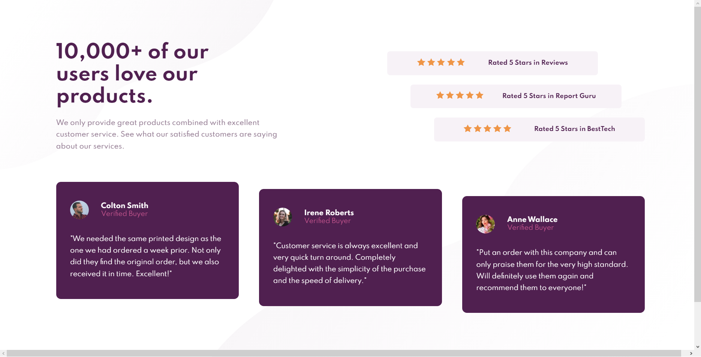
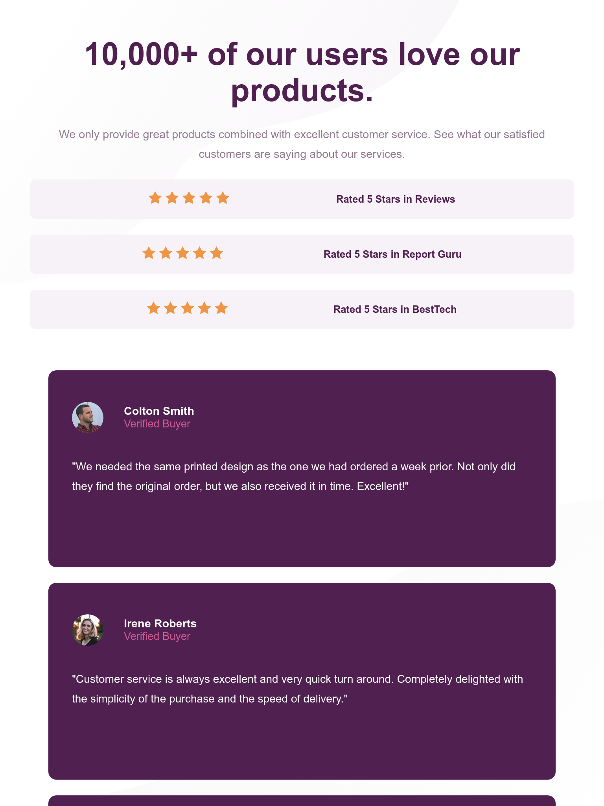

# Frontend Mentor - 3-Column Preview Card Component Solution

This is a solution to the [Social Proof Section](https://www.frontendmentor.io/challenges/social-proof-section-6e0qTv_bA). Frontend Mentor challenges help you improve your coding skills by building realistic projects. 

## Table of contents

- [Overview](#overview)
  - [The challenge](#the-challenge)
  - [Screenshot](#screenshot)
  - [Links](#links)
- [My process](#my-process)
  - [Built with](#built-with)
- [Author](#author)

## Overview

### The challenge

Users should be able to:

- View the optimal layout depending on their device's screen size

### Screenshot

### Links

- Solution URL: [https://github.com/jv-miranda/Social-Proof-Section](https://github.com/jv-miranda/Social-Proof-Section)
- Live Site URL: [https://jv-miranda.github.io/Social-Proof-Section/](https://jv-miranda.github.io/Social-Proof-Section/)

## My process

### Built with

- Semantic HTML5 markup
- CSS custom properties
- Flexbox
- Media Queries

## Author

- Linkedin - [João Vitor Miranda](https://www.linkedin.com/in/jo%C3%A3o-vitor-miranda-8b445222b)
- Frontend Mentor - [@jv-miranda](https://www.frontendmentor.io/profile/jv-miranda)